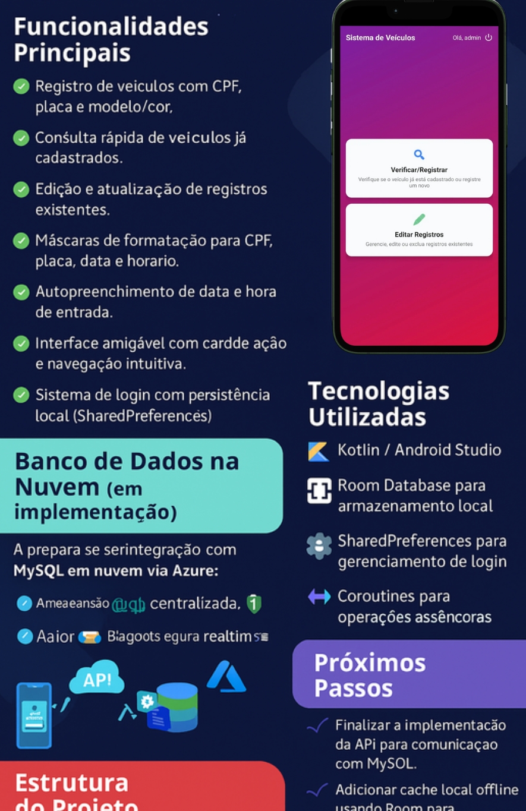

# Aplicativo de Controle de Veículos

## Descrição
O **Aplicativo de Controle de Veículos** é uma solução Android completa para gerenciamento de entrada e saída de veículos em condomínios, empresas ou estacionamentos.  
Ele permite registrar informações como CPF, placa, modelo/cor do veículo, motivo da visita, horários de entrada e saída, e observações adicionais.

---

## Funcionalidades Principais
- Registro de veículos com CPF, placa e modelo/cor.
- Consulta rápida de veículos já cadastrados.
- Edição e atualização de registros existentes.
- Máscaras de formatação para CPF, placa, data e horário.
- Autopreenchimento de data e hora de entrada.
- Interface amigável com cards de ação e navegação intuitiva.
- Sistema de login com persistência local (SharedPreferences).

---

## Tecnologias Utilizadas
- **Kotlin / Android Studio**
- **Room Database** para armazenamento local.
- **SharedPreferences** para gerenciamento de login.
- **Coroutines** para operações assíncronas.

---

## Banco de Dados na Nuvem (em implementação)
O app está sendo preparado para integração com **MySQL em nuvem via Azure**.  
Essa implementação permitirá:

- Armazenamento centralizado de dados, acessível de qualquer dispositivo.
- Sincronização em tempo real entre múltiplos usuários.
- Maior segurança com backups automáticos e criptografia.
- Possibilidade de escalabilidade e manutenção simplificada.

**Fluxo planejado:**


- O app enviará os dados para uma **API** que irá gerenciar a comunicação com o banco MySQL hospedado no Azure.
- Essa arquitetura permitirá consultas, inserções, atualizações e exclusões centralizadas, mantendo a consistência dos registros.

---

## Próximos Passos
- Finalizar a implementação da API para comunicação com MySQL.
- Adicionar cache local offline usando Room para sincronização quando houver conexão.
- Implementar filtros de pesquisa avançados no app (por CPF, placa ou nome do usuário).
- Melhorar a experiência do usuário com notificações de registros e saídas de veículos.

---

## Estrutura do Projeto
 `ui/` → Atividades e interfaces do usuário
 `data/` → Room Database e DAOs
 `model/` → Entidades e modelos de dados
 `res/` → Layouts, drawables e strings
- `utils/` → Classes auxiliares (máscaras, validações, etc.)

---



## Como Rodar
1. Clonar o repositório:
```bash
git clone https://github.com/AdrianKoll/VehicleAccessManager.git
